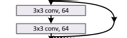
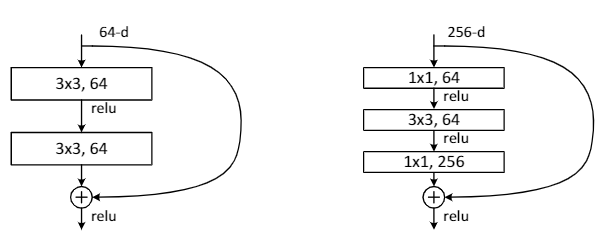
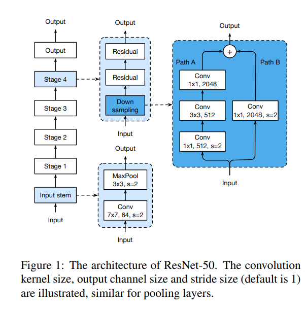
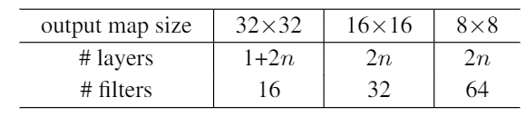
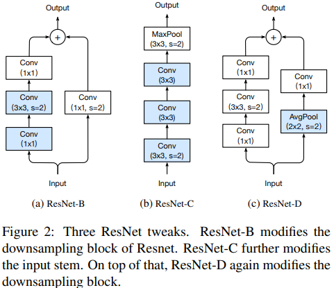
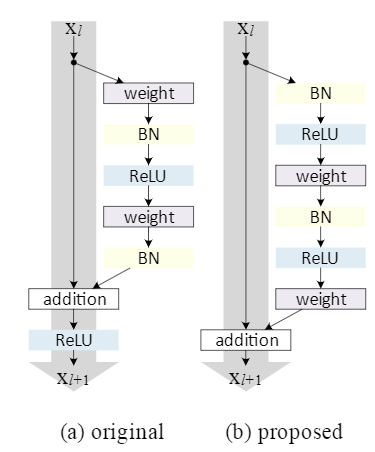

-> from paper to code <-

## A Brief History of ResNet

I love ResNets. I just do. I can’t stop thinking about them. They are simple yet effective. It inspired so many models that came after while still holding its own. Many ResNets or variations of it serve as the backbone of important image detection pipelines. Although they are already 5 years old at the time of writing, I do not see them going away anytime soon. Even though the emerging EfficientNets show promise, the recently published assembled-net paper shows us that ResNets are far from irrelevant.

Unfortunately, however, many articles and videos discussing convolutional neural networks start with AlexNets, VGGs, inception, and taper off with ResNets. Many articles do illustrate what ResNets are and how they work so well, but few really go down to their nitty gritty details, implementation quirks and variations. That is what I am trying to do.

I will start this chain of articles by first shortly summarizing the original ResNet paper and the original model as is. The original models, as they were described in the paper and used to win the 2015 ILSVRC and COCO competitions, are available on [github](https://github.com/KaimingHe/deep-residual-networks).

Venerable as they are, they were first created using the caffe framework. Coming from a PyTorch background, they are recognizable, but I am not confident conducting a line by line analysis of said model. Instead I will focus on the TorchVision version of those models available [here](https://github.com/pytorch/vision/blob/master/torchvision/models/ResNet.py). I will conduct a line by line analysis in a later article.

One of the most common and well studied ResNet is the 50 layer version, the ResNet50. Not all ResNet50s come the same however, as there are several widely known and used versions each called ResNet50 but with incompatible differences.

Although a CNN model is much more than its architecture, I will primarily focus on the architecture and structures only. Please note that models with equal architectures may behave differently depending on how they are initialized and trained.

To closely examine the ResNet architecture themselves, it helps to read the original papers that introduced them. Lets dive right into the first paper.

## Deep Residual Learning for Image Recognition

This paper was first published in 2015 by researchers from Microsoft Asia. By building upon the previous successful deep network the VGG and exploring identity mappings, this paper introduced to the world what is now known as ResNet. These identity mappings are referred to as shortcuts, residual or skip connections depending on the in other papers or architectures.

These skip connections allow activations (or signals) in the forward pass or gradients(or error updates) to freely pass through deeper layers of the network. Beyond this basic intuition, they are implemented in various different ways including concatenation, elementwise addition etc. There still seems much to be studied regarding how they work.

The following is an excerpt from the paper that captures its design decisions.

“The convolutional layers mostly have 3×3 filters and follow two simple design rules: (i) for the same output feature map size, the layers have the same number of filters; and (ii) if the feature map size is halved, the number of filters is doubled so as to preserve the time complexity per layer. We perform downsampling directly by convolutional layers that have a stride of 2. The network ends with a global average pooling layer and a 1000-way fully-connected layer with softmax. The total number of weighted layers is 34.”

The authors first derived a plain model *without* skip connections modeled after VGG. From this plain 34 layer baseline, they added **2 kinds of skip connections**. When the input feature map (start of the skip) and the dimension of the output feature map (destination of the skip) are identical, a simple addition operation can be usedv(solid lines). But when the dimensions are different there must be a way to reconcile the difference. Since the feature map size is either **constant** or **halved** going from input toward output, the difference in dimension is a factor of 2 both in the number of channels and size of the feature map. To cross this feature map difference, either a **zero padded identity mapping** or a **1x1 convolution** to project across can be used. These residual connections give ResNets the high accuracy and trainability they are known for.

Looking at Table 1 you can see the parameters of the various ResNets described. Interestingly, they all share a **common ‘head’ and a ‘stem’**. The **head** is the last part starting with the average pool, 1000 way fully connected layer ending with a softmax layer for output. Also, the input layer consisting of 64 channels of a 7x7 convolution with stride 2 followed by a 3x3 max pool with a stride of 2 is also common to all of the layers.
This part, which is referred to as **conv1** in the table, is often referred to as the ‘stem’ of the ResNet. Some consider the 3x3 maxpool layer also part of the stem since it is common to the above 5 ResNets, but it is sometimes missing or replaced in other variants of ResNets. It is worth noting that the original paper nor the codebase do not refer to them as ‘stem’ as part of official nomenclature.

Before I go further I would like to describe a convention when describing neural networks with the words start, stem, first, input, output, head. The signal goes from the **start, stem, or input** layer towards the **last, head(or top), output** layer where it is often classified. Also signals flows from **left to right, bottom to top** and changes from input to output. This might not hold for all networks (such as the inception family with multiple auxiliary classifiers)

In between the head and the stem are 4 convolutional layers, or ‘stages’. Although the table refers to them as **‘layers’** each called conv2_x, conv3_x, conv4_x and conv5_x, it is often called as **“stages”** as they each include many individual 3x3 and 1x1 convolutional layers. Some refer to these stages starting from 2, considering the stem the first stage. I find it easy to reason when considering them on their own. As such, I will refer these as stage 1 through 4. (Thus conv2_x excluding the MaxPool layer becomes stage 1, conv3_x becomes stage 2 so on and so forth).In other words, ResNets consist of a stem, 4 intermediate stages, and a head.

Within each stage are the same blocks, and between each block is a skip connection.
As aforementioned, when one stage ends and another begins, the number of filters is **doubled, while the size of the feature map is halved** in each of its dimensions.

After considering the cost and benefit of using zero padding and 1x1 convolutions the authors decided to use 1x1 projections to gap this difference. Do note that skip connections can be done in other ways. Identity concatenation (which trades more memory footprint for less computation), different points of entry(inverted bottlenecks), multiple destinations (which functions as feature reuse), convolutions and nonlinearity in between the skip connections(to gap a difference in dimension or to increase expressivity) can and have been done to yield various different models.

 The above figure shows a single basic block from stage 1 of a ResNet34. The incoming signal splits out to an outbound skip connection, followed by two consecutive 3x3 convolutions of the same size, whose outputs are joined by the previously mentioned skip connection which is added elementwise.

 The first block of each stage is called the downsampling block. It is called that because it performs the necessary downsampling in input feature dimensions with a strided convolution. The downsampling block also is the first block to have its filter count doubled.

ResNet18 and ResNet34 intermediate stages feature only 3x3 convolutional filters of stride 1. Two consecutive 3x3 filters comprise **one block** and **between** these blocks are skip connections.

The difference between ResNet18 and ResNet34 is the number of blocks in each stage. There are **two blocks** in each stage of ResNet18 (4 stages each with 2 blocks each with 2 convolutional layers plus the head and stem equals 18), while there are **3,4,6,3 blocks** for each of ResNet34’s stages (2 + (3+4+6+3) * 2 equals 34).
With this almost doubling increase comes an almost doubling of FLOPs.

Going from ResNet34 to ResNet50, we discover that though the block count of each layer remains constant, there is a fundamental difference in the block structure.
Because of concerns on the training time, the authors employ a “bottleneck” block.

Instead of two consecutive 3x3 convolutions, the bottleneck block employs 1x1 convolutions **before and after** a single 3x3 convolution. What is more, the first convolution is of the **same** channel number of the original 3x3 convolution, but the final 1x1 layer has **4 times the channels**. Note that from the architectural principles that we’ve uncovered so far, it is apparent just from the above figure that it describes blocks from the first stage (evident from the main channel number of **64**).

Considering the fact that each block is repeated several times in each stage, we can see that the channel count repeatedly increases 4 fold (the “expansion ratio is 4”) **within a block** and comes back down 4 fold going into the **next block**. Like a bottleneck.

The result of changing the block from basic to bottleneck is quite remarkable.
From ResNet34 to ResNet50, the ‘layer’ count is increased to 50 (4 stages each with 3,4,6, and 3 blocks, with each block having 3 layers. Plus the head and stem). But the ***FLOPs count is only changed by around 5%.***

ResNet101 further increases block number in stage 3 and 152 increases it in stages 2 and 3, with concomitant increases in FLOPs and parameters.

It is worth mentioning that ***not all FLOPs are the same***. If the FLOPs are held constant, 3x3 convolutions can be done with higher throughput then with 1x1 convolutions in the GPU. Although FLOPs count is used to compare the computational complexity and requirement for a given architecture, the specific throughput, latency, memory footprint tradeoff is different for each platform and must be considered in a case by case basis.

Unless otherwise noted all convolutional layers are followed by a Batch Normalization and a ReLU activation.

## But what about ResNet 20,32,44,56? or ResNet v1d, v1.5, v2? (Other variants of ResNet)

The previous section describes ResNets designed for ImageNet. The images vary in resolution but it is commonly trained and tested on patches of around 256x256 pixels. The above ResNets follow VGG convention of 224x224 patches.

In the original paper, the authors suggest a slightly different model for CIFAR-10.
CIFAR-10 is a much more simple dataset with smaller images all being 32x32.

The first layer, which is comparable to the stem of the ImageNet models, is composed of one 3x3 convolution. Three 3x3 convolutions in stacks of 2n layers follow. Their respective feature map sizes are 32x32,16x16 and 8x8. As the output map size halves, the filter numbers double starting from 16 and ending in 64. Since CIFAR-10 contains 10 classes the last layer contains a 10 way fully connected layer. Thus the final number of layers become 3 * 2n + 2(head and stem) or 6n + 2.

Thus ResNets that the original authors designed for CIFAR-10 become ResNet20 (n=3), ResNet 32 (n=5), ResNet56 (n=9) all the way up to ResNet1202(n=200). In such deep regimes, however, the authors find that while they were successful in training the deep network to convergence, the validation accuracy is actually worse then for ResNet-101, a significantly simpler model.

Depending on how you design your pipeline it is possible to use models meant for **ImageNet on CIFAR-10 or vice versa**. Some frameworks such as fast.ai make this easier. You might require more architectural changes beyond the bare minimum necessary (which would be to adjust the head and the input part of the stem to match input and output sizes) to satisfy your training and testing requirements, but this practice is actually not uncommon.

When ResNets came out, many researchers and data scientists took note. Many projects and frameworks took ResNet and *added their own improvements*. Torch (which later became PyTorch) investigated various architectural changes regarding strides and location of BN and activations. In the end they changed the location of the stride = 2 in the 3x3 conv rather than the first 1x1 convolution in the block. 
For a refresher, the **downsampling would have been done by having the first 1x1 convolution of the first block of a stage have a stride of 2**. This was done **when the filter count is doubled and the feature map size is halved** in each dimension. Instead Torch researchers proposed to have the **first 3x3 convolution of the first block of each stage** have a stride of 2.

In the Torch codebase this version is *merely referred to as ResNet*. Some projects (such as Keras and NVIDIA) noted the difference and improvements called them ResNet v1.5. Most others follow torch and merely call their version merely *ResNet* or *ResNet v1* (as opposed to the following v2). TensorFlow notes the difference but still calls it v1. In other words, unless the authors of a paper or a model go out their way to mention that this directly follows the original paper and not subsequent enhancements, you can assume a “vanilla ResNet” is actually ResNet v1.5. (You can also read the code and look at where the stride is)

The gluon CV toolkit also provides an extensive ResNet model zoo. Here, the slightly modified ResNet is called v1b(rather than v1.5). Their v1c further changes the stem into three 3x3 convolutions from a single 7x7 convolution. v1d (also called ResNet-D) adds a 2x2 AvgPool layer with stride of 2 during downsampling to further preserve information (This path is the dotted shortcuts in the original paper). As previously mentioned, *when feature maps halve, the residual connection incorporates a 1x1 convolution to bridge the different dimensions in channels and feature map*. Since this convolution has a ***kernel size of 1x1 and stride of 2, some information is lost***. The 2x2 AvgPooling expands the receptive field to cover all inputs, correcting this problem. (The 2018 paper [Bag of Tricks for Image Classification with Convolutional Neural Networks](https://arxiv.org/abs/1812.01187) summarize these changes well)

Alongside the original ResNet v1 (which is actually a slightly improved v1.5), ResNet-D is another widely used modern variant.

In 2016, the authors of ResNet themselves revisit various skip connection topologies and strategies. The paper can be found here [Identity Mappings in Deep Residual Networks](https://arxiv.org/abs/1603.05027) and part of the code can be found in the  github [here](https://github.com/KaimingHe/ResNet-1k-layers). The models introduced here are often considered as ResNet v2. In v2 the order of convolutions, BN and ReLu is adjusted. While v1 would do Conv-> BN->ReLu, v2 goes BN->ReLu->Conv.

This change allowed them to train much deeper networks than their original paper. Although put forward by the original authors of ResNet, ResNet v2 (which is not what the authors called it) did not catch on as much as v1.5 or v1d. (v2 is not the only models they put forward in the paper, but other models such as PreResNet are much less prominent in the wild even when compared to v2)

Now that we have a descriptive understanding of ResNets and their immediate pedigree, in the next article, I will see how one is actually implemented in code.
